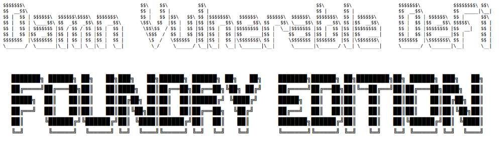

A Foundry rewrite of [Damn Vulnerable DeFi](https://www.damnvulnerabledefi.xyz/)

## Notes

This repository was created because I wanted to learn more about Solidity and Foundry, and try my hand at the Damn Vulnerable Defi challenges. I encourage you to read my code in the repo, especially the tests and how I've created them. And when you've solved a challenge, switch to the solutions branch and compare my thoughts and solution to how you did it. I am not (yet!) an expert, and there may be better or more efficient ways to do things.

My hope and intention with this repository is that you improve your Foundry knowledge as well as learn the Damn Vulnerable Defi challenges. There are no set rules. I have attempted to make getting started very easy by doing as much setup as possible, but you are free to modify the code and tests as you see fit. Whatever helps you learn is what you should do!

Please submit a pull request if you find an issue or want to add something!

#### **Known Issues:**

1. In the solutions branch, my solutions for #13 and #14 do not work, and I am having trouble determining why. If you are attempting those challenges, it is possible that your solutions may be correct but still not work if I have not written the tests or setup correctly. If you can fix them, please submit a PR to the solutions branch!! **I am offering a $150 bounty** paid in ether for each of those two challenges, for the first submission that fixes the solution branch and explains why my solution didn't work (or why my test was not correctly setup). I very much want this repo to be complete and work for all challenges.
2. There are compilation warnings about the size of the test contract in "test/09 - PuppetV2.t.sol" and script in "script/Deployers/09 - Deploy Puppet V2.s.sol". Those warnings can be ignored.
3. Sometimes I have setup tests in an odd way, or done things that may seem unnecessary. The most common example of this is deploying contracts via bytecode. Usually this is because I need a contract written in a different Solidity version than the one the test is using, because I am trying to ensure the compiler versions match whatever was used in the original challenges. But there may be other oddities as well. Please contact me or submit a PR if you find something you believe is wrong or is causing problems.

## The offensive security playground for the decentralized finances

Damn Vulnerable DeFi is the wargame to learn offensive security of DeFi smart contracts in Ethereum.

Featuring flash loans, price oracles, governance, NFTs, DEXs, lending pools, smart contract wallets, timelocks, and more!

## Prerequisites

1. Basic Foundry knowledge. You should have used Foundry a little bit and be familiar with how to write a Foundry test and use `forge test` to test a contract. Also, you should be able to use `anvil` to create a local chain fork.

2. A Linux-like terminal environment to run `forge test` in, the Foundry tools (forge, cast, and anvil) and the `jq` Linux program. Some tests require using anvil to create a fork or using cast to get information from an RPC endpoint. When this is necessary, it is noted in the _readme.txt_ file for each challenge. However, you should also examine the contracts test files and ensure you understand what is happening before running the test. (It's ~~generally~~ always a bad idea to run untrusted code, especially when that code knows you probably have crypto on your machine.)

    - _FFI is explicitly disabled in the config, and if a test requires it, that is noted in the **readme.txt** file. Once again, I encourage you to read the test file before executing a test, especially if it uses FFI._

3. An RPC endpoint (with an API key if necessary) set to the environment variable `ETH_RPC_URL`. Additionally, if you have an Etherscan account, setting your Etherscan API key to the environment variable `ETHERSCAN_API_KEY` would be useful. Some of the tests fork or get data from the RPC endpoint, so it's useful have an endpoint already setup in your environment. I recommend having an account and API key for your endpoint, so that you are not rate-limited. A free account on Alchemy or Infura will suffice, but whatever endpoint you choose, it **must be an archival node**, so that historical data is available.

## How to play

1. Ensure that all [foundry tools](https://github.com/foundry-rs/foundry) and necessary Linux terminal programs are installed.
2. Clone [the repository](https://github.com/maxweisspoker/damn-vulnerable-defi-foundry).
3. Run `git submodule update --init --recursive && forge install OpenZeppelin/openzeppelin-contracts-upgradeable --no-commit && git submodule update --init --recursive` inside the `damn-vulnerable-defi-foundry` folder to ensure dependencies are installed and set to the correct versions.
4. Delete the file `damn-vulnerable-defi-foundry/test/00 - Setup Script.t.sol` since it merely causes `forge build` to fail with an error telling you to run the command in step 3.
5. Commit the changes from steps 3 and 4 so that you can preserve them when you switch branches in the next step.
6. Switch/checkout a new branch off the main branch, so that any upates or changes to the repo don't create conflicts while you are working.
7. Code your solution in the `src` folder, inside the `solveChallenge()` function that is in the `YOUR_SOLUTION.sol` file for each challenge. (You can ignore the contract name in the `YOUR_SOLUTION.sol` file -- I named them something I thought was fun rather than just "AttackContract".)
8. Then just run the test using the challenge name and at least two v's (`-vv`) of verbosity. For example: `forge test --mt Unstoppable -vv` or `forge test --mt Side_Entrance -vv`. (Challenge names that contain multiple words can be called `Like_This` or `LikeThis`. You can also use the challenge number, e.g. `forge test --mt 03 -vv`. Numbers 1-9 need to be prefixed with a zero.)
9. If the test is executed successfully without a revert, you've passed!
10. (Optional) To get a call trace that may help you debug a test failure, you can use five v's (e.g. `forge test --mt Unstoppable -vvvvv`). Alternatively, you can go through the EVM code byte-by-byte by replacing the `--mt` or `--match-test` argument with the `--debug` argument. For example: `forge test --debug Unstoppable`

## Tips

-   To code the solutions, you may need to read about [Foundry](https://book.getfoundry.sh/).
-   In all challenges you must use the account called `player`. This is usually coded in for you inside the tests using `vm.prank(player)`, but if it is not, keep this rule in mind.
-   Some challenges may require you to code additional functions inside the solution contract, or even create and deploy new custom smart contracts. Feel free to modify the solution contract to fit your needs. You may also want to read and modify the test contracts that test your challenge in order to properly run any additional contracts or functionality you've created. The purpose of this repository and of the Damn Vulnerable Defi challenges is to help you learn, so you should do whatever is necessary to acheive that goal!
-   Go [here](https://github.com/tinchoabbate/damn-vulnerable-defi/discussions/categories/support-q-a-troubleshooting) for troubleshooting, support and Q&A on the challenges. But keep in mind this support is for the original hardhat javascript version of Damn Vulnerable DeFi and they may be unable to help you. Feel free to start discussions or raise issues in this Foundry Edition repo.
-   Please submit pull requests if you find issues or errors, or think you can make the repository better!

---

< version v3.0.0 >

Damn Vulnerable DeFi created by [@tinchoabbate](https://twitter.com/@tinchoabbate) - maintained by [The Red Guild](https://theredguild.org)

**Foundry Edition** created by Max Weiss
